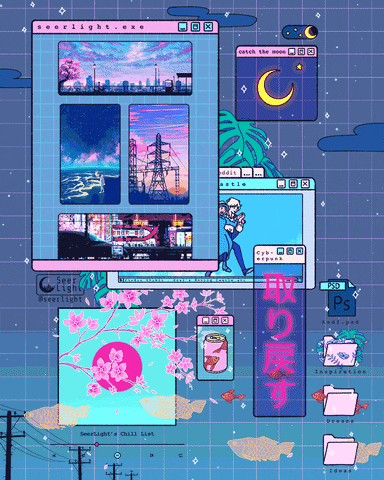

# Hi ! Welcome on my page, here is your coffee (>'-')> ☕️
 

 

## About Me 🍵
 

Hello ! 🤗 I am N0ku, currently studying at the [**Coding Factory by ESIEE-IT**](https://codingfactory.fr/?gclid=CjwKCAjw3ueiBhBmEiwA4BhspCjySMrnCNb0PwkhblihXCypNev604sewJMhQkxe0SzQTU429EZw_xoCrBEQAvD_BwE), I started learning to code in 2019.

I regularly work on several personal projects that you can find here, as well as my school projects carried out with my different comrades. Feel free to take a look at my work ! 😉

### School github organizations

 

  - [**Coding Factory Students**](https://github.com/codingfactory-by-itescia)
  - [**Coding Factory School projects**](https://github.com/CodingFactory-Repos)

 

## Discord Presence

## Programming Skills 💻
 

 

## Some stats 📊
 

 

 
<!--
**N0ku/N0ku** is a ✨ _special_ ✨ repository because its `README.md` (this file) appears on your GitHub profile.

Here are some ideas to get you started:

- 🔭 I’m currently working on ...
- 🌱 I’m currently learning ...
- 👯 I’m looking to collaborate on ...
- 🤔 I’m looking for help with ...
- 💬 Ask me about ...
- 📫 How to reach me: ...
- 😄 Pronouns: ...
- ⚡ Fun fact: ...
-->
